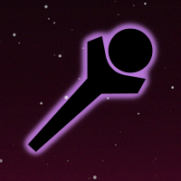

<h1>Chat Commands</h1> 

[Custom Bot Commands](#custombot)  
[Standard Bot Commands](#standardbot)

## Custom Bot Commands {#custombot}

Mach mein Leben...interessanter...mit diesen Commands.  
Nimm Einfluss auf das Gameplay.  

Der Custom Bot ist selbst gebaut und könnte kaputt gehen. :P  
Commands haben 2 Minuten Cooldown!

<h4><u>Allgemein</u></h4>  

**?count** - Zeigt die Anzahl der Commands die du verwendet hast.  
**?scoreboard** - Zeigt das Scoreboard der Top 10 User die meinen Untergang wollen.  

<h4><u>Tastatur</h4></u>

**?jump** - Drückt die Leertaste.  

<h4><u>Maus</h4></u>

**?mrandom** - Bewegt die Maus auf eine zufällige Position.  
**?mup** - Bewegt die Maus nach oben.  
**?mdown** - Bewegt die Maus nach unten.  
**?mleft** - Bewegt die Maus nach links.  
**?mright** - Bewegt die Maus nach rechts.  

<h4><u>Mechabellum</h4></u>

**?buyshield** - Kaufe ein Schild.  
**?buyrocket** - Kaufe eine Rakete.  
**?buyunit <1-14>** - Kaufe einheit auf dem gewählten slot. (rechtsoben nach linksunten)  

## Standard Bot Commands {#standardbot}

Ein paar Stanard-Commands. :)  

<h4><u>Valorant</h4></u>

**!valrank** - show current rank + elo  
**!valtrack** - tracker.gg profile  

<h4><u>General</h4></u>

**!stickers** - Stickers Info  
**!commands** - Command Info  

<h4><u>Fun</h4></u>

**!gg**  
**!throwing**  
**!unthrowing**  
**!catears**  
**!focus**  
**!magic**  